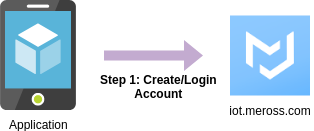
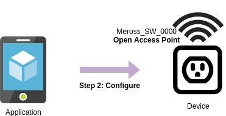
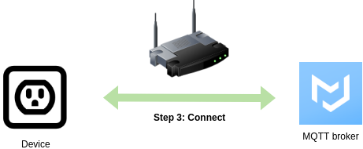
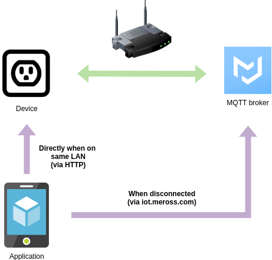

# How a device is configured

## Step 1: Creating an Account (optional)



When you purchase a Meross device you install an application on your mobile device. The purpose of this app is to 
configure devices, using WiFi. Before you do this a `userId` and `key` are generated for your account which is used as
the credentials for all of your devices.

I have created a CLI tool `meross-cloud` that enables you to create and login to `iot.meross.com` which follows the same
process as the app. This is not required but is useful for ketting the "key" for your existing Meross devices.

eg.
```
#  meross-cloud -email test@example.com -pass your_password -list

TODO sample output
```


## Step 2: Configuring to the Device


On start a device blinks green with red flashing. If a device is not in this state it can be reset by holding the power
button for a few seconds.

You should now see a WiFi network `Meross_SW_0000` where `SW` is the type of device SW = switch and 0000 is the last 4
digits of the MAC address. There should be a sticker on the device indicating the MAC to help determine which device 
you're configuring if you have multiple.

Once you have connected to the access point the device performs the following key steps to configure a device
1. Scans for Wifi networks
2. Configures details of MQTT servers
3. Configures Wifi credentials

This is done by sending the `GET` and `SET` packets via HTTP to `http://10.10.10.1/config`

The tool `meross-device` can be used to mimic the application and provision your device to connect to your own MQTT
server.

**Note:** If you wish to use username/password authentication in MQTT the username used is the MAC address with `:`
characters and the password is the md5sum of the concatination of the MAC and key. Given that the device doesn't
contain a trust store I see little value in using authentication.

```
# meross-device scan -url URL -raw <testdata/responses/GETACK-wifi-list+SETACK-config-wifi.json
{
  "wifiList": [
    {
      "ssid": "dGVzdCBTU0lE",
      "bssid": "2c-6e-a4-55-c6-47",
      "signal": 100,
      "channel": 3,
      "encryption": 6,
      "cipher": 3
    },
    {
      "ssid": "dGVzdCBTU0lEMg==",
      "bssid": "4d-23-0e-3c-a2-22",
      "signal": 20,
      "channel": 3,
      "encryption": 6,
      "cipher": 3
    }
  ]
}

# meross-device config -url URL -user-id 1234 -key testkey -mqtt-host localhost
If using auth in your MQTT server use these credentials
Username: 34:29:8f:ff:ff:ff
Password: 5ac868a81f2f21b4a87f7d2bb3467cb5

# meross-device wifi -url URL -bssid 2c-6e-a4-55-c6-47 -password test
```

After the wifi command completes the device will restart.

## Step 3: Connecting to Broker


On start the device will try to find and connect to the WiFi network specified in the `Appliance.Config.Wifi` request.
If the network is not available the device will restart and go back to the beginning of Step 2.

Once the device connects to a network successfully it will attempt to connect to the MQTT broker specified in the
`Appliance.Config.Key` request

In my testing the device sends an `Appliance.System.Clock` to the `/appliance/<UUID>/publish` topic until it gets a 
response. From testing the response must be sent via MQTT to the topic `/appliance/<UUID>/subscribe`. If a response is
not received within 10 attempts the device will restart and go back to the beginning of Step 2.

In the "Official" scenario Meross performs a number of requests to the device to configure the device fully. Including
but not limited to a get of `Appliance.System.All` and a setting of `Appliance.System.Time`.

Once the device light turns a solid green then it is ready to receive commands via HTTP and/or MQTT.

**Note:** The device I used for my testing required that TLS be used. The device doesn't do any validation on the
certificate so a self signed certificate is sufficient.

Here is a sample Mosquitto configuration that enables a Meross device to connect to it, in this example I have disabled
authentication but if you want to enable it don't forget to configure the username and password on your broker as per
the details from Step 2.

## Controlling



Once a device has completed configuration it will  
Listen for requests on: `/appliance/<UUID>/subscribe`  
Publish responses and `PUSH` messages on: `/appliance/<UUID>/publish`

Given an MQTT broker is required for the device to be happy during its initial startup I would suspect most would not
bother using HTTP to control the device. However the same endpoint, used for configuring the device, can be used to 
perform all `GET` and `SET` commands from those defined in the [protocol](protocol.md).

The `meross-device` command currently only support HTTP and will send/receive any `payload` section of the Meross
[protocol](protocol.md)

This command is an example of how to send a raw command which is equivalent to the the command 
`meross-device ability -url http://DEVICE_IP/config -raw -key <yourkey>`
```
echo '{}' | meross-device raw -url URL -namespace Appliance.System.Ability -method GET -key <yourkey>
{
  "payloadVersion": 1,
  "ability": {
    "Appliance.Config.Key": {},
    "Appliance.Config.WifiList": {},
    "Appliance.Config.Wifi": {},
    "Appliance.Config.Trace": {},
    "Appliance.System.Online": {},
    "Appliance.System.All": {},
    "Appliance.System.Hardware": {},
    "Appliance.System.Firmware": {},
    "Appliance.System.Time": {},
    "Appliance.System.Clock": {},
    "Appliance.System.Debug": {},
    "Appliance.System.Ability": {},
    "Appliance.System.Runtime": {},
    "Appliance.System.Report": {},
    "Appliance.System.Position": {},
    "Appliance.System.DNDMode": {},
    "Appliance.Control.Toggle": {},
    "Appliance.Control.Timer": {},
    "Appliance.Control.Trigger": {},
    "Appliance.Control.Consumption": {},
    "Appliance.Control.ConsumptionX": {},
    "Appliance.Control.Electricity": {},
    "Appliance.Control.Upgrade": {},
    "Appliance.Control.Bind": {},
    "Appliance.Control.Unbind": {}
  }
}
```