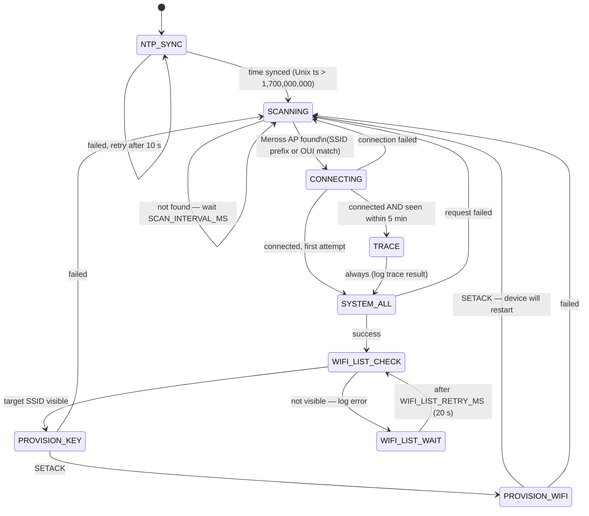

# esp8266-provisioner

An ESP8266 (D1 Mini v4) PlatformIO project that automatically discovers unconfigured
Meross smart devices in AP mode nearby, then walks through the full provisioning
sequence over HTTP — without any cloud dependency.

---

## How it works

On boot the device syncs NTP via your home WiFi, then continuously scans for
unconfigured Meross APs (`Meross_SW_*` SSID or `48:e1:e9`/`34:29:8f` OUI).
When one is found it connects and runs the following provisioning flow:



### Appliance.Config.Trace
If the same device AP (matched by BSSID) was seen within the last 5 minutes the
provisioner runs `Appliance.Config.Trace` first. This mirrors what the official
Meross app does and logs the last-known WiFi association state of the device before
continuing with a full re-provision.

### WifiList retry
The provisioner stays connected to the Meross AP while waiting for the target
SSID to become visible. It re-issues `Appliance.Config.WifiList` every 20 seconds.
This is useful when a router is slow to broadcast or the device needs a moment
to complete its scan.

### BSSID format
Meross devices may report BSSIDs using either `:` or `-` as a byte separator
(firmware-version-dependent). The provisioner stores the raw BSSID string from
the `wifiList` response and forwards it unchanged in `Appliance.Config.Wifi`, so
both formats are handled correctly.

---

## Prerequisites

- [PlatformIO Core](https://docs.platformio.org/en/latest/core/installation.html) or PlatformIO IDE
- Wemos D1 Mini v4 (or any ESP8266 board — adjust `board` in `platformio.ini`)
- The target WiFi network must be the same one the D1 Mini can reach on boot
  (for NTP sync). `HOME_SSID` and `TARGET_SSID` may be the same value.

---

## Configuration

Edit [`include/config.h`](include/config.h) before building:

| Constant | Description |
|---|---|
| `HOME_SSID` / `HOME_PASSWORD` | WiFi the D1 Mini uses on boot to sync NTP |
| `TARGET_SSID` / `TARGET_PASSWORD` | Network to provision Meross devices onto |
| `MQTT_HOST` / `MQTT_PORT` | Primary MQTT broker |
| `MQTT_SECOND_HOST` / `MQTT_SECOND_PORT` | Secondary broker (set `""` / `0` if unused) |
| `MQTT_KEY` | Pre-shared signing key from your Meross account |
| `MQTT_USER_ID` | User ID from your Meross account (string) |
| `SCAN_INTERVAL_MS` | How often to scan for Meross APs when idle (default `30000`) |

The OUI prefixes used to detect Meross devices (`48:e1:e9`, `34:29:8f`) are
defined in `src/main.cpp` in `is_meross_ap()`.

---

## Build

```bash
# Compile firmware only
pio run -e d1_mini

# Compile, upload, and open serial monitor
pio run -e d1_mini -t upload && pio device monitor
```

---

## Tests

Unit tests cover the base64 encode/decode module (pure C++, no hardware needed).
Test vectors include real SSID values captured from live Meross device responses.

```bash
pio test -e native
```

Expected output:

```
test/test_base64/test_main.cpp:18: test_encode_empty               [PASSED]
test/test_base64/test_main.cpp:23: test_encode_one_byte            [PASSED]
...
-----------------------
18 Tests 0 Failures 0 Ignored
OK
```

---

## Flash & monitor

After configuration:

```bash
pio run -e d1_mini -t upload
pio device monitor --baud 115200
```

### Expected serial output

```
[boot] Meross ESP8266 provisioner starting.
[ntp] Connecting to home WiFi for NTP sync...
[ntp] Time synced: 1745000000
[scan] Scanning for Meross APs...
[scan] Found Meross AP: SSID=Meross_SW_ef1a  BSSID=48:e1:e9:xx:xx:xx
[connect] Connecting to Meross_SW_ef1a ...
[connect] Connected. IP=10.10.10.2
[sysall] type=mss310  uuid=...  mac=48:e1:e9:xx:xx:xx
[sysall] firmware=6.1.8  innerIp=
[wifilist] Target SSID found.  bssid=2c:6e:a4:55:c6:47  ch=6
[key] MQTT config accepted (SETACK).
[wifi] WiFi config accepted (SETACK). Device will now restart and connect to "YourSSID".
```

---

## Project layout

```
esp8266-provisioner/
├── platformio.ini          # Build config (d1_mini + native test env)
├── include/
│   ├── config.h            # All hardcoded constants — edit before flashing
│   └── mdp.h               # Meross Device Protocol helper declarations
├── src/
│   ├── mdp.cpp             # Packet builder, MD5 signing, HTTP POST, base64 wrappers
│   └── main.cpp            # State machine entry point
└── test/
    └── test_base64/
        └── test_main.cpp   # Unity tests for base64 encode/decode (Densaugeo library)
```

---

## Protocol reference

See [`doc/protocol.md`](../doc/protocol.md) and [`doc/provisioning.md`](../doc/provisioning.md)
for the full Meross Device Protocol specification, including all packet formats
used in this project.
